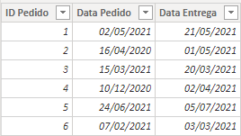
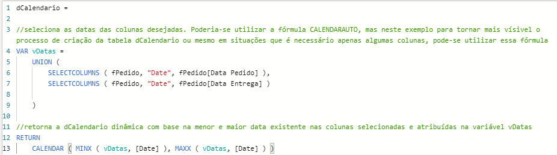
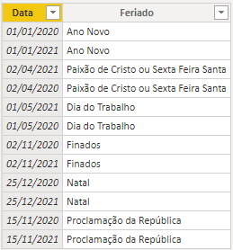
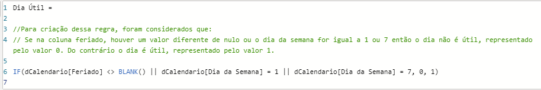
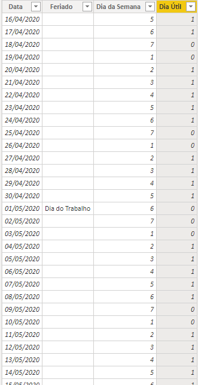
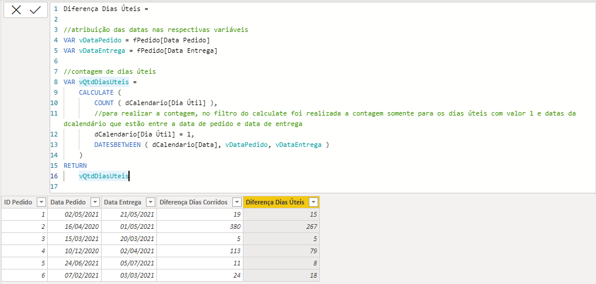

# PBI-Diferença-Dias-Úteis
Realizando o cálculo de diferença de dias úteis em DAX

Há diversas maneiras de realizar o cálculo de dias úteis no Power BI, e infelizmente (ou não, rsrs) no Power BI não existe uma função como a Networkdays existente no Qlik. Desse modo, é necessário criar uma lógica para realizar esses cálculos, seja para realizar uma soma ou mesmo para realizar uma diferença entre duas datas.  
Nesse exemplo, o objetivo é realizar a diferença entre a data de entrega e a data de pedido desconsiderando sábados, domingos e feriados. 

Inicialmente, podemos observar a tabela fPedidos, com as colunas ID Pedido, Data Pedido e Data Entrega.

Observando essa tabela, o primeiro passo é criar uma tabela dCalendario para realizar a busca das datas. Existem várias maneiras de criá-la, seja em DAX ou M. Como esse exemplo é totalmente construído em DAX. Demonstro abaixo uma maneira que ultimamente realizo as criações da dCalendario. Ressalto que não é a melhor maneira, nem a pior, mas pra tornar visível o processo, optei por esse modo.

Após criar a dCalendario, realizei a inclusão de maneira manual de alguns feriados para tornar esse exemplo o mais completo possível. 

Após os feriados disponibilizados no PBI, o próximo passo foi criar uma coluna na dCalendario buscando os feriados com a função LOOKUPVALUE. 

Finalizando esse passo. Uma nova coluna foi criada para identificar o número do dia da semana, onde: Domingo é igual a 1 e Sábado é igual 7.

Por fim, sabe-se que, se a data possuir um feriado, ou o dia da semana for igual a 1 ou 7, o dia não é útil, do contrário, temos um dia útil. Essa regra foi criada em uma nova coluna, conforme imagem abaixo. 

Dessa forma, pode-se observar como a dCalendario ficou após a criação das regras mencionadas acima. 

E agora, para realizar o cálculo dos dias úteis, basta identificar a data inicial e final (na tabela fPedido). Identificando essas datas, como gosto de trabalhar com variáveis, realizei a atribuição em duas variáveis, respectivamente. Após isso foi implementada uma lógica para realizar a contagem dos dias úteis com a função CALCULATE, onde é necessário contar os dias úteis quando o seu valor for igual a 1 e as datas da dCalendario precisam estar dentre a data de pedido e data de entrega. Para isso, pode-se utilizar a função DATESBETWEEN.  
O resultado final, pode ser observado abaixo. 

